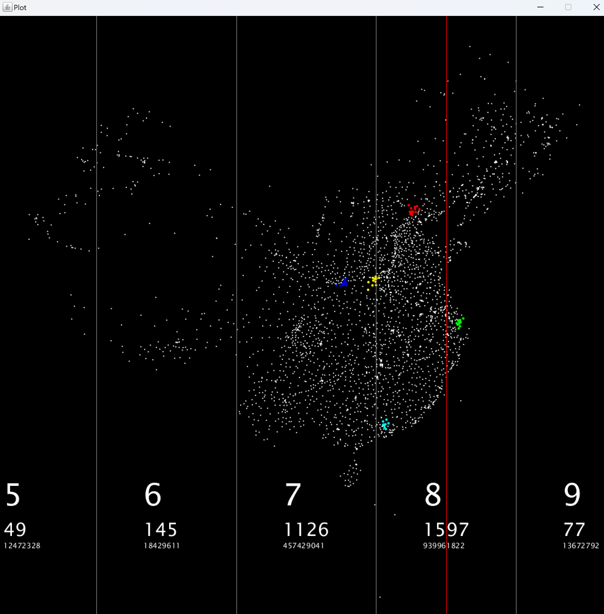

# Processing Template
This Project is a skeleton for using [Processing](https://processing.org/) with NORMAL IDE.
if anybody tend to use processing with Intellij IDEA,
instead of [PDE](https://processing.org/download), can use this template.

## requirement
JDK 21

## setup
just import this project as a maven project

## data source
* population data from 7th population census
* lng & lat from AMap api response
